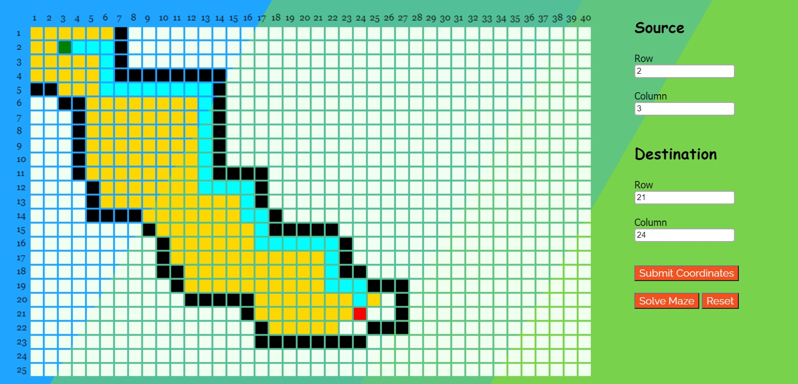

# Path-Tracer

## What it does?
* It is a path tracer which computes shortest distance between source and destination in the grid.

## Technologies Used 💻
* JavaScript 
* HTML
* CSS
## How To start? ⁉
* At starting we will be given an empty grid, we have to choose our own row and column numbers for source and destination and submit co-ordinates.
    ### Note: Do not give the row number greater than 25 and column number greater than 40 for both source and destination, because those are the boundary limits.
* After that we can add obstacles if we want by click and hovering simultaneously with mouse (obstacles are black color grids in the matrix).
* Lastly press the solve button once you satisfied with adding obstacles, it results the shortest path between the source and destination.
## Screen Shots 📜

### Code is commented in 'pathtracer.js' file.
